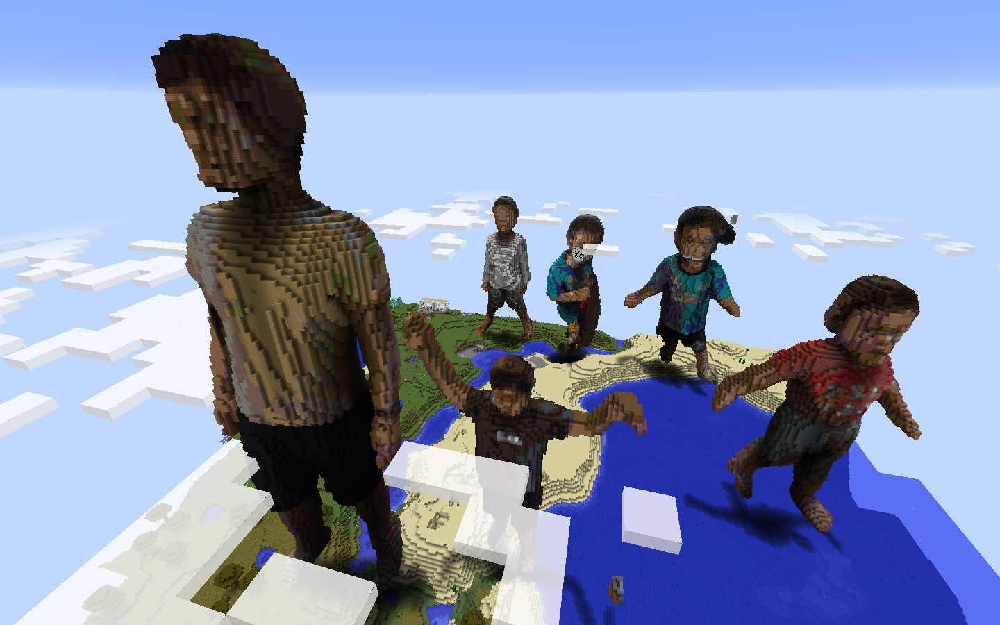

# TitanCraft
[](https://colab.research.google.com/github/takecx/TitanCraft/blob/master/TitanCraft.ipynb)

Generate titan from single image into your Minecraft World!!



## How to Use

### 1. Clone this repo

```bash
$ git clone https://github.com/takecx/TitanCraft.git
$ cd TitanCraft
```

### 2. Restore submodule

```bash
$ git submodule update -i
$ cd remove_bg
$ git submodule update -i
$ cd ..
```

### 3. Download `FBA_Matting` model

Download `FBA_Matting` model from [here](https://drive.google.com/uc?id=1T_oiKDE_biWf2kqexMEN7ObWqtXAzbB1) and place it to `./remove_bg/FBA_Matting/FBA.pth`.

### 4. Download `PIFu` model

Download `PIFu` two models from [here](https://drive.google.com/uc?export=download&id=1zEmVXG2VHy0MMzngcRshB4D8Sr_oLHsm) and [here](https://drive.google.com/uc?export=download&id=1V83B6GDIjYMfHdpg-KcCSAPgHxpafHgd) and place there to `./PIFu/checkpoints/`.

### 4. Create Environment

You should create python environment using `requirements.txt`.

```bash
$ conda create -n TitanCraft python=3.7
$ conda activate TitanCraft
$ pip install -r requirements.txt
```

### 5. Prepare input image file

Put input image file to `./data/` dir for example.

### 6. Run script

Run `TitanGenerator.py` with some arguments.

```bash
$ python TitanGenerator.py (input image) --kernel_size (morphology kernel size) --iteration (morphology iteration num) --output_dir (output dir) --h_max (height max value) --w_max (width max value)
```

#### Arguments

1. input image file path (required)
2. `--kernel_size` : kernel size of morphology conversion (optional)
3. `--iteration` : iteration num of morphology conversion (optional)
4. `--output_dir` : Output dir of generated .schematic file (optional)
5. `--h_max` : max height of converted schematic (optional)
6. `--w_max` : max width(length) of converted schematic (optional)

For example, 

- input image file path : `./data/sample.png`
- `--kernel_size` : 5
- `--iteration` : 3
- `--output_dir` : `./output/`
- `--h_max` : 100
- `--w_max` : 150

then, you run 

```bash
$ python TitanGenerator.py ./data/sample.png --kernel_size 5 --iteration 3 --output_dir ./output/ --h_max 100 --w_max 150
```

### 7. Import `.schematic` to your Minecraft World!!

Import generated `.schematic` file (saved in `./output/`) to your own Minecraft World using [WorldEdit mod](https://www.curseforge.com/minecraft/mc-mods/worldedit).
